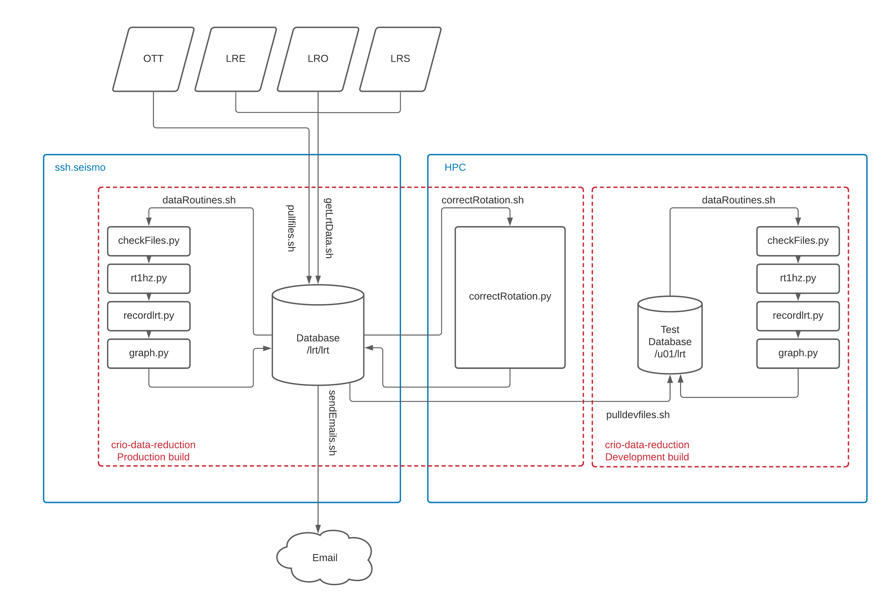
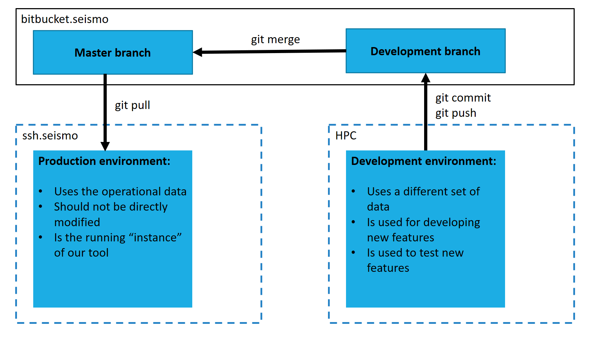

# cRio-data-reduction
## Table of contents
1. [Installation](#1-installation)
   
   1.1 [Anaconda Installation](#11-anaconda-installation)

   1.2 [NPTDMS Installation](#12-nptdms-installation) 
2. [Background](#2-background)

    2.1 [Python Scripts Overview](#21-python-scripts-overview)
- [cRio-data-reduction](#crio-data-reduction)
  - [Table of contents](#table-of-contents)
  - [1. Installation](#1-installation)
    - [1.1 Anaconda installation](#11-anaconda-installation)
    - [1.2 NPTDMS installation](#12-nptdms-installation)
- [2. Background](#2-background)
  - [2.1 Python scripts overview](#21-python-scripts-overview)
  - [3. Manual Usage](#3-manual-usage)
  - [4. Automation Setup](#4-automation-setup)
  - [5. Development](#5-development)
  - [6. Production Deployment](#6-production-deployment)
  - [7. Config File setup](#7-config-file-setup)
  - [8. Catch-up Feature](#8-catch-up-feature)
  - [9. SSH Connection](#9-ssh-connection)
  - [10. Contacts](#10-contacts)

## 1. Installation


<!-- Here is a link to this diagram: https://lucid.app/lucidchart/671ca3df-638b-41e0-ba3b-db330ff0b61d/edit?invitationId=inv_46ce8883-d2b3-4490-b171-2c59bcdc5aa7
Please make sure to edit it as you make modifications.-->

On a linux server navigate to the home directory

From this github repository click `Clone or download` then click on `Use SSH` copy the link

Now in the terminal type `$ git clone [Copied directory]`

Upon proper installation the file structure should appear as the following
```
$HOME
|-- anaconda3
|--cRio-data-reduction
|   |-- ottSecData (D)
|   |-- lrtRecords (D)
|   |-- logging.conf
|   |-- option.conf
|   |
|   |-- src
|   |   |-- checkFiles.py
|   |   |-- formatdata.py
|   |   |-- rt1hz.py
|   |   `-- graph.py
|   |
|   |-- correctRotation
|   |   |-- correctRotation.py
|   |   `-- correctRotation.sh
|   |
|   |-- bashfiles
|   |   |-- pullfiles.sh
|   |   |-- dataRoutines.sh
|   |   |-- getLrtData.sh
|   |   `-- sendEmail.sh
|   |
|   |-- plots
|   |   |-- LRE (D)
|   |   |-- LRO (D)
|   |   `-- LRS (D)
|   |  
|   |-- logFiles
|   |   |-- record (D)
|   |   |-- graphing (D)
|   |   |-- filestransfer (D)
|   |   `-- checkfiles (D)
|   |
|   `-- assets (D)
```

### 1.1 Anaconda installation

1. Go to https://repo.continuum.io/
    - This is the anaconda home page

2. On the page find and click on `View All Installers`

3. Select and download `Anaconda-5.0.1-Linux-x86_64.sh`
    - There may be newer versions and they may work
    - The linux server may not support a newer version at
                some point in time

4. Using shell (or any other secure file transfer) move the .sh
    file to your home directory. In the ssh terminal type:
    `bash Anaconda-5.0.1-Linux-x86_64.sh`
    - Or the extension of the version you installed

5. Select yes to the default options. This will create the `anaconda3` file in your
   home directory.

6. Wait for the installation to complete and close the terminal

7. Reopen the terminal and type `python`
   -You should see something similar to:
    ```
    bash-4.2$ python
    Python 3.6.3 |Anaconda, Inc.| (default, DATE,TIME)
    ```
    -type `quit()` to leave this process

8. If you did not see Anaconda, Inc. and instead saw that was
   missing or perhaps python you have a few more steps to follow.

9. Locate and open your `.bash_profile`file

10. Near the end of the file you should see a line which says
       `export PATH`. Edit this line so that it is:
       ```
       PATH="/home/YOURFILE/anaconda3/bin:$PATH"
       ```

11. Save the file and exit.

12. Try step (7.) again

    8-12. EXPLAINED:
    Essentially the installation of anaconda is supposed to add
    this line to your profile on its own, and it does on some
    linux servers. It does not on this one and thus we have to
    do it manually.

### 1.2 NPTDMS installation

1. Navigate to:
    https://github.com/adamreeve/npTDMS

2. Download the zip file which should show up as: `npTDMS-master.zip`

3. Unzip the file

4. Move the unziped file to you `/home/YOURFILE` directory

5. Navigate into the `npTDMS-master` folder and type:
    `python setup.py install`

# 2. Background

By using the package `npTDMS` (an addition to numpy package) we can read the `.tdms` file type.
The values can be reached refering to a specific node on the tree. A tdms file is broken up into different types of objects; the root object, the group object, and the channel object.

The root object records background info such as file name, title, and author.
The group and channel objects are related. The group object defines the type ofdata you want to look at (in our case all of the data is either 'v32Hz' or 'v100Hz' group). The channel refers to which record device you wish to look under.

For example:
Suppose you had a device that recorded 100Hz and 32Hz with 2 channels. Then you would be able to look up data under

<'100Hz', 'channel 1'>

<'100Hz', 'channel 2'>

<'32Hz', 'channel 1'>

<'32Hz', 'channel 2'>

and each would have their own set of data.


Specifics:
- The data recorded by the sites output everything under both '100Hz' and '32Hz'

- Each site has 4 channels you can call ['channel 1', 'channel 2', 'channel 3', 'channel 4'] 

-channel 1 refers to X 

-channel 2 refers to y 

-channel 3 refers to z 

-channel 4 refers to F

-32Hz  files are in the Serial Folder

-100Hz files are in the Analog folder

## 2.1 Python scripts overview

There are 5 main python scripts:

`formatdata.py`
- Includes the classes for collecting, compiling and altering data 
- Has attributes for the axial components as well as different methods for manipulating the data

`rt1hz.py `
- Uses `formatdata.py` 
- Reads through 32hz tdms files and creates 1hz files

`recordlrt.py `
- Uses `formatdata.py ` , `correctrotation.py`
- Reads through 32hz tdms files and creates a list of times that had  
  high noise and times of possible interferance 
- Returns a fair number of false positives and could be refined

`graph.py  `
- Uses `formatdata.py `
- Plots Entire days using the created 1hz files 
- Plots hourly times of those returned by `recordlrt.py`

`correctrotation.py`
- Used by `rt1hz`
- Attempts to correct missalignment in the lrt sites

## 3. Manual Usage  

To become accustomed with some of the features built in try running some of the following code:

We can start by importing the files needed and operating on some data. The way this is done may appear a little
awkward with how the date is used, but this program was created to be run automatically. So the date is created
with a variable of days ago
```
from src.formatdata import Date, Data
two_days_ago = Date(2)
data = Data('secNew', two_days_ago, 'LRO', '/home/dcalp/lrt/LRO/RT1Hz/')
data.data[0]
```
This will output the x data stream for LRO from two days ago. Try running the
above for `data.data[0]`, `data.data[1]`, `data.data[2]`.

Now we will continue and do some operations on the data to create new attributes.

```
# Creates 10s running average
data.make_smooth(10)
data.data[0]

# Create rate of change attribute
data.make_rate_change()
data.roc[0]

# Changes data to be in average+-variance
data.make_variance()
data.data[0]
data.avg[0]
```
Consider looking in the source for more options and experimenting.


## 4. Automation Setup

 For an explanation on how to set up anaconda read the text file `ANACONDAINSTALL.txt`

 To automate these procedures add the following to you `crontab -e` file

 ```
 1 1 * * * [Home]/lrt_data/bashFiles/pullfiles.sh &> [Home]/lrt_data/log/filetransfer.log

2 1 * * * [Home]/lrt_data/bashFiles/dataRoutines.sh

0 2 * * * [Home]/lrt_data/bashFiles/sendEmail.sh

0 */3 * * * [Home]/lrt_data/bashFiles/getLrtData.sh

 ```


No further editing should be need to have the program begin to run. It is possible that a file directory was not moved
over to have an abstract location and if this arises it should only need to be edited to the expected formation.

## 5. Development



In order to facilitate the development of this application, a certain set of good practices must be followed. First of all, you can clone this repository locally by running the following command:

```
git clone http://bitbucket.seismo.nrcan.gc.ca/scm/lrt/crio-data-reduction.git .
cd crio-data-reduction
```
This will clone a local instance of the repository to your machine. Afterwards, you must select the development branch:
```
git checkout development
```
Then, to obtain test datasets, run:
```
bash bashFiles/pulldevfiles.sh
```
You may have to make modifications to pulldevfiles.sh in order to specify the correct directories. Next, you must edit the config file properly, see [Config File setup](#7-config-file-setup) below. In addition, you should look through the bash files (specifically sendEmail.sh) to make sure they are using the correct user information (email, etc.).

The development branch is used to work on implementing features or fixing bugs. Essentially, all changes should be made on the development branch. In order to test your changes, you will have to run everything in development mode. To do so, make sure you open the option.conf file and change the is_dev value to True (`is_dev = True`).

You may now add changes to the code by editing the files on your local repository, then committing those changes as such:

```
git commit -m "MESSAGE"
git pull
git push
```

You can commit as many times as you want before pulling/pushing. In addition, make sure to add a proper description of your implemented changes in lieu of MESSAGE. When enough is added and everything that was implemented is thoroughly tested and working, you may merge your changes from the development branch into the master branch:

```
git checkout master
git merge development
```

Once that is done, all changes made onto development will be merged into master. 

## 6. Production Deployment

This section details the steps needed to set up a running instance of this tool that acts on the operational dataset.
1. First, clone this repository:
    ```
    git clone http://bitbucket.seismo.nrcan.gc.ca/scm/lrt/crio-data-reduction.git .
    cd crio-data-reduction
    ```
2. Then update the config file (/crio-data-reduction/option.conf) in order to follow the recommendations in the [config file setup section](#7-config-file-setup).
3. Go through the bash files (pullfiles.sh, getLrtData.sh, dataRoutines.sh, sendEmail.sh) in order to make sure all the user information such as email addresses are correct.
4. Follow the [automation setup](#4-automation-setup).

After these steps are done, the tool should be running fully automatically.


## 7. Config File setup

The config file is located in /cRio-data-reduction/option.conf

Here are the recommended settings:

[Paths]

`file_directory`: Path from home folder to crio-data-reduction folder (most likely simply `/crio-data-reduction`).

`lrt_file_directory`: Path to the folder of list of LRT locations, on ssh.seismo: `/lrt/lrt`.

[Record]

`save_dir`: Path from base folder to lrtRecords folder (most likely simply `/lrtRecords/`)

`lrt_dir`: Should be as `/{0}/Serial/{1}/`

[Plots]

`save_dir`: Path to the plots folder (normally `/plots/`)

`size_x`: Should be 15

`size_y`: Should be 15

`sigma_dev`: Should be 4.0

`sec_dir`: Full path to ottSecData folder (normally `$HOME/crio-data-reduction/ottSecData/{0}/`)

`secNew_dir`: Full path to the RT1Hz folder (normally `/lrt/lrt/{0}/RT1Hz/{1}/`)

`v32Hz_dir`: Full path to the 32Hz folder (normally `/lrt/lrt/{0}/Serial/{1}/`)

`is_dev`: False or True, depending on if you are developping. Should be False for the production build.

## 8. Catch-up Feature

All the data routines are programmed to run daily, but it is possible to have them run from a certain day onward: this allows someone to run the tool from a specific day onward. To do so, one can simply edit the file named `lastday.txt` located in `crio-data-reductio/log/`. The date inserted should be in the format DD-MM-YYYY. Once the tool has succesfully ran from that day onward, it will modify this date to be today's date.

## 9. SSH Connection

SSH connection needs to be made to a few servers however their IP's will not be listed here. The list of servers used by the programs on default are listed below.

- Sun2 server

- LRE

- LRS

- LRO

## 10. Contacts

David Calp, Supervisor: david.calp@nrcan-rncan.gc.ca / 613-295-4226

Andrew Kovachik, Student: kovachik.andrew@gmail.com / 226-228-6957

David Rene, Student (F21): davrene11@gmail.com / 581-986-4960
